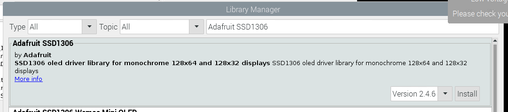
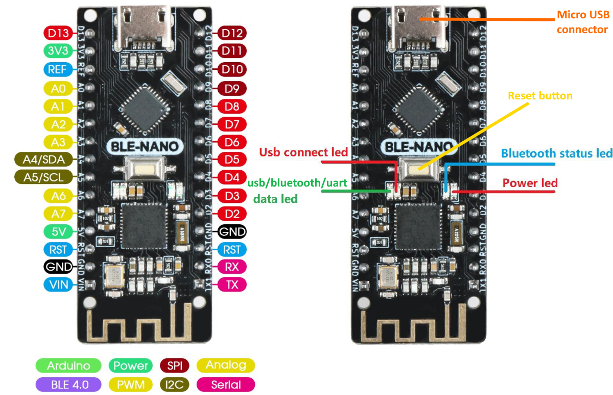

# Introduction
This project contains the Arduino Lock module program for the Door Lock.

| Git Repository | Module |
|--|--|
| https://github.com/weesing/doorlock | This repository.
| https://github.com/weesing/doorlock_rpi | NodeJS API Server connected with main module to control different aspects of the main module, can be executed on Raspberry Pi.
| https://github.com/weesing/doorlock_rfid | RFID module for scanning RFID tags.

- The API server and module components are used for complementing the main module.
- This module should be able to function without the need for other modules.
- All aforementioned modules communicate by means of BLE.
> Note: This means if you want to construct all related modules, the Arduino used must have a BLE module or a BLE-Nano.

## Example Implementation
https://www.reddit.com/r/arduino/comments/o8vpap/have_been_a_lurker_in_this_sub_for_a_long_time/

# Required Arduino libraries
- `Adafruit GFX`
- `Adafruit SSD1306`

## Installing required libraries
- Go to Arduino IDE
- Under `Tools` -> `Library Manager`
- Search for `Adafruit GFX` and `Adafruit SSD1306`
- Click on `Install`

# Components Used
| Component | Power Requirements | Usage
| -- | -- | -- |
7.5v Power Supply or Battery Pack equivalent | N/A | Power supply
BLE-Nano (Arduino) | 6v | Main controller
MG995 Continuous Servo | 7.5v (direct from power supply) | Main servo for turning the door knob
SG90S Metal Pinion | 6v | Linear movement to engage/disengage main servo to/from actual door knob
128x64 OLED SSD1306 | 6v | Controller display
ADXL335 Accelerometer | 6v | Determines the lock status of the door knob
Buck Convertor | N/A | To step down to 6V

> Refer to `defines.h` to know which pins are used.

> Note: ALL servos must have ground back to the Arduino for the data from Arduino to flow back.

# Secrets
- A `secret_defines.h` should be created in the `DoorLock` directory (alongside `DoorLock.ino` file).
- A sample header file can be found in `secret_defines.sample.h`.
- The header file contains a definition named `SECRET_KEY`. This is used when giving the command `<lock>` through BLE (see `bleLoop()`)
> You can omit this if you are not communicating with the main module through BLE (either through the API server module or through a mobile app).

# References
## Pin Reference

